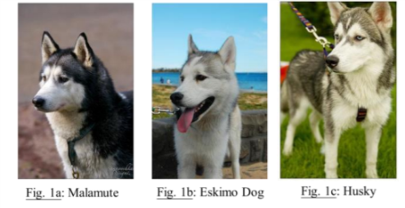
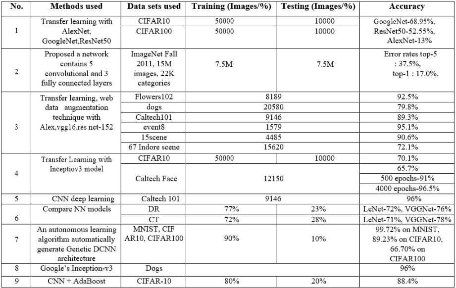

# Classify-Dog-Breeds-using-CNNs

### **Domain Background**

Convolutional neural networks (CNN) have been used to great effect in applications such as object classification, scene recognition, and  their applications. In many situations, we can imagine the features (both low-level and higher-level) that are learned by the CNNs in the process of training. However, when the objects the CNNs are trying to categorize share many similar features, such as the breeds of dogs, it becomes hard to imagine the specific features that CNNs must learn in order to categorize these dogs correctly. This is especially  true if we take a look at sets of images such as Fig. 1 below, where the 3 dogs share almost all the same visible features, but belong to different classes. It is therefore interesting to see how well CNNs can perform on only dog breeds, compared to labels from all classes of
objects in the regular ImageNet. 

### **Problem Statement**

Image classification is the process of taking an input (like a picture) and outputting a class (like “cat” or "dog") or a probability that the input is a particular class (“there’s a 90% probability that this input is a cat”). You can look at a picture and know that you’re looking at a terrible shot of your own face, but how can a computer learn to do that?

### **Datasets**
Make sure that you've downloaded the required human and dog datasets:
- Download the [dog dataset](https://s3-us-west-1.amazonaws.com/udacity-aind/dog-project/dogImages.zip) .  Unzip the folder and place it in this project's home directory, at the location `/dogImages`.
- Download the [human dataset](https://s3-us-west-1.amazonaws.com/udacity-aind/dog-project/lfw.zip) . Unzip the folder and place it in the home diretcory, at location `/lfw`.
*Note: If you are using a Windows machine, you are encouraged to use 7zip to extract the folder.*

### **Solution Statement**

The goal of this project is to create a dog breed identification application using convolutional neural networks. The resulting algorithm could be used as part of a mobile or web app. This design can be applied to image classification problem.

 The code will accept any user-supplied image as input.  If a dog is detected in the image, it will provide an estimate of the dog's breed.  If a human is detected, it will provide an estimate of the dog breed that is most resembling.

### **Benchmark Model**

### **Evaluation Metrics**
The evaluation metrics of this problem is simply the Accuracy Source for the designed algorithm.

### **Project Design**

The overall flow consists of the following steps:

In building our classifier we will be following below steps:
- Import Datasets : Our first step will be to load the datasets that are divided into train, validation and test folders.
- Detect Humans : In this section, we use OpenCV's implementation of Haar feature-based cascade classifiers to detect human faces in images.
- Detect Dogs : In this section, we use a pre-trained VGG-16 model to detect dogs in images.
- Create and train a CNN to classify Dog Breeds (from scratch) : In this step, we will create a CNN-based model from scratch that classifies dog breeds. In the next step, we will use an approach based on transfer learning.
- Train a CNN to Classify Dog Breeds (via transfer learning) : We will now use transfer learning to create a CNN that can identify dog breed from images. We will reuse the data loaders that we created earlier.
- Dog breed classification algorithm : 
    - if a dog is detected in the image, return the predicted breed.
    - if a human is detected in the image, return the resembling dog breed.
    - if neither is detected in the image, provide output as other thing.
- Testing the algorithm : Lastly, We will test our algorithm on six sample images to measure the performance of our algorithm.

### **References**
- For [Domain Knowlegde](http://cs231n.stanford.edu/reports/2015/pdfs/fcdh_FinalReport.pdf)
- For [BenchMark Models](https://www.ijrte.org/wp-content/uploads/papers/v7i5s4/E10900275S419.pdf)

### **Reviews & Validations**
- From [Udacity](https://github.com/mehtajinesh/Classify-Dog-Breeds-using-CNNs/edit/master/review.pdf)

